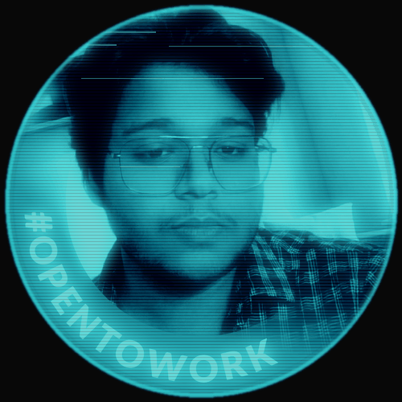
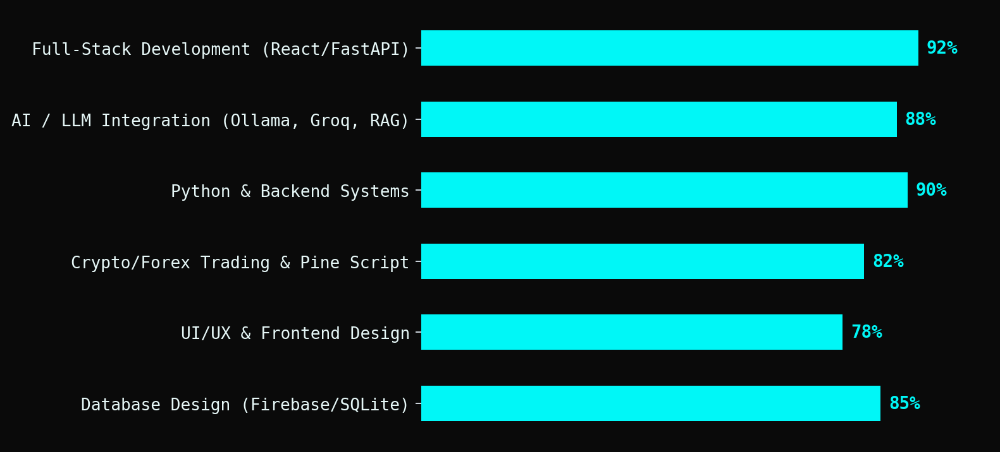

<div align="center">





<br/>

[](mailto:harshraj9428@gmail.com)
[](https://www.linkedin.com/in/harsh-raj-861213338)
[](#)


</div>


### ⚡ About Me

```yaml
name: Harsh Raj
role: Solo Full-Stack & AI Developer
education: IIT Patna — CS & Data Analytics (CPI 9.79/10)
focus: [AI/LLM apps, Full-stack products, Crypto/Forex trading]
philosophy: "Build it end-to-end. Ship it. Move to the next one."
```

- 🛠️ Design → build → ship complete products solo — frontend, backend, AI layer, deployment
- 🤖 Deep in **LLM-powered apps** — local (Ollama) & cloud (Groq) inference, RAG, agents, bots with real memory/mood
- 📈 Active **crypto/forex trader** — Binance Futures automation, Wyckoff + SMC + ICT Pine Script strategies
- 💎 Build production tools for my family's jewellery business, **Sri Ganesh Gems & Jewellery** (est. 1998)
- 🌱 Currently sharpening ML fundamentals (KNN, decision trees, Gini impurity) and DSA (sorting, Master's Theorem)

<div align="center">

</div>


### 🧠 Tech Stack

<div align="center">


<br/><br/>


</div>


### 🚀 Featured Projects

<table>
<tr>
<td width="50%" valign="top">

**🤖 Charu Bot**
<br/>
<sub>Python · Groq Llama-3.3-70B · SQLite · Railway</sub>
<br/><br/>
Telegram AI companion with persistent memory, mood state machine (HAPPY/ANNOYED/CARING…), proactive messaging & GIF support.

</td>
<td width="50%" valign="top">

**📊 AutoTrader Pro**
<br/>
<sub>FastAPI · React · Binance Testnet · Ollama</sub>
<br/><br/>
Full-stack AI crypto trading dashboard — live signals, ATR-based setups, WebSocket data feed, kill switch.

</td>
</tr>
<tr>
<td width="50%" valign="top">

**💎 Sri Ganesh Gems**
<br/>
<sub>React · Vite · Tailwind · Framer Motion</sub>
<br/><br/>
Luxury gemstone catalogue with Vedic astrology (Rashi Ratna) recommendations & WhatsApp enquiry flow.

</td>
<td width="50%" valign="top">

**🔮 AstroGem AI**
<br/>
<sub>FastAPI · OpenCV · Groq API</sub>
<br/><br/>
Computer-vision gemstone analyzer + Vedic astrology recommendation engine, deployed on Railway.

</td>
</tr>
<tr>
<td width="50%" valign="top">

**💸 SplitTruth**
<br/>
<sub>React · Firebase Firestore</sub>
<br/><br/>
Group expense tracker with Trust Scores & ghost-payer detection, receipt-ledger aesthetic.

</td>
<td width="50%" valign="top">

**📈 FPE — Financial Personality Engine**
<br/>
<sub>React · TypeScript · Zustand · FastAPI</sub>
<br/><br/>
Indian bank SMS parser, budget/goals PWA with an AI financial advisor.

</td>
</tr>
<tr>
<td width="50%" valign="top">

**🧠 SAMI v2.0**
<br/>
<sub>Python · Gradio · Ollama · Whisper</sub>
<br/><br/>
Fully local personal AI assistant — voice, vision, Gmail/Calendar integration, RAG knowledge base.

</td>
<td width="50%" valign="top">

**🌱 MannMitra**
<br/>
<sub>React · FastAPI · Groq · Firebase</sub>
<br/><br/>
Mental wellness companion for JEE/NEET aspirants with crisis detection & KIRAN helpline integration.

</td>
</tr>
</table>

> 📌 Swap the project titles above into links (`[Charu Bot](your-repo-url)`) once this is live in your profile repo.


### 📊 GitHub Stats

<div align="center">


</div>


### 🎯 Skill Proficiency

<div align="center">

</div>


### 🗺️ Roadmap — What's Next

```
 2026 ─────────────────────────────────────────────────────▶
  │
  ├─ ✅ Capstone-I (DailyTrack) — AI routine tracker, submitted
  ├─ ✅ Sri Ganesh Gems — live e-commerce catalogue on Vercel
  ├─ ✅ Charu Bot v2 — memory + mood engine, deployed
  ├─ 🔄 Deepening ML fundamentals — KNN, decision trees, ensembles
  ├─ 🔄 Refining ETH/BTC futures strategy — Wyckoff + SMC + ICT
  └─ 🎯 Next build — Interactive "How a Laptop Works" visualizer
```


<div align="center">

### 📡 Let's Connect

[](mailto:harshraj9428@gmail.com)
[](https://www.linkedin.com/in/harsh-raj-861213338)

<sub>Building in public, one commit at a time. 🚀</sub>


</div>
